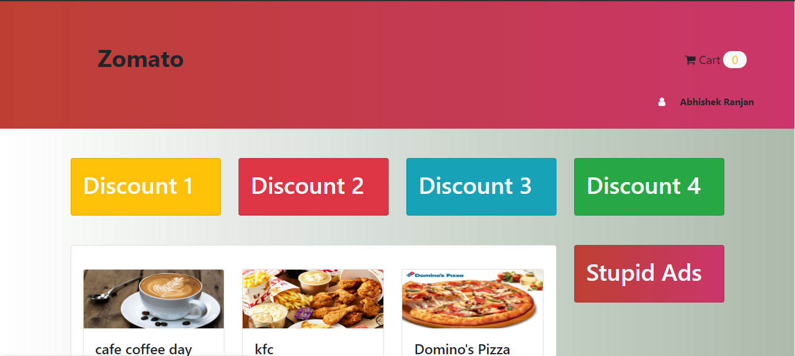
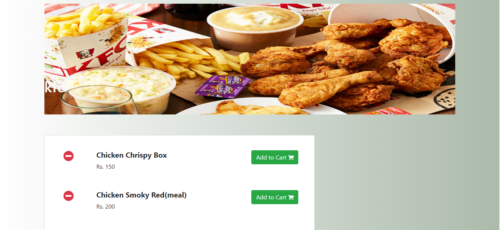
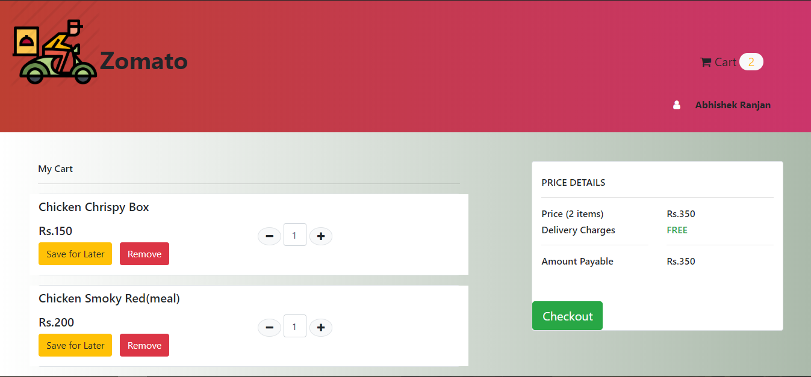

# Zomato

# About
Zomato is a food delivery website allows you to choose from which restaurant you want to order the food and allow you to save your items in the cart and featured with checkout facility.

# Software and Languages :
1. HTML
2. CSS
3. Bootstrap
4. Php
5. Jquery
6. MySQL
7. Xampp(software for creating server)

# Working 
The website contains a Login page for authentication. Then you move to a home page where you got list of restaurants which offers you with a different varieties of food.
As you select a restaurant its shows you food menu present in that individual resturant and allow you to select the food and add it to your cart.
Website is featured with checkout facilitiy.

# Database
There are four different tables:
1. User (For login authentication )
2. Restaurant
3. Menu
4. Order Details (Details of every user who have ordered food from the restaurant )

# Overview

